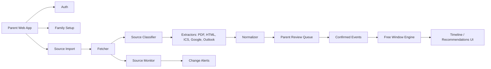

# Architecture

## Decisions

| Area | Decision |
|---|---|
| Product surface | Private beta |
| Platform | Responsive web app first, native mobile later |
| Frontend | Next.js + TypeScript |
| Backend | Next.js server routes for MVP; extract workers/services when ingestion load requires it |
| Database | PostgreSQL |
| ORM | Prisma |
| File storage | Local filesystem in development; object storage in beta/prod |
| Auth | Email/password, Google login, Login with Apple |
| Calendar integrations | PDF, URL, ICS, Google Calendar, Outlook Calendar |
| Parsing | Hybrid deterministic parsers plus LLM-assisted extraction |
| Review model | Parent confirmation required before extracted events affect recommendations |

## System Overview



## Core Services

| Service | Responsibility |
|---|---|
| Auth service | Accounts, sessions, OAuth providers, token lifecycle |
| Family service | Families, children, calendar ownership, calendar tags |
| Source service | URL/PDF/ICS/provider source metadata and refresh state |
| Fetch service | Retrieve public pages, PDFs, ICS feeds, and provider calendar events |
| Extract service | Convert raw source content into candidate events |
| Normalize service | Map candidates to canonical event schema and categories |
| Review service | Store confirmation, edits, rejection, and confidence status |
| Matching service | Compute overlapping free windows and conflict explanations |
| Alert service | Detect source changes and mark saved windows at risk |

## Initial Repository Shape

```text
app/
  api/
  family/
  imports/
  review/
  windows/
components/
lib/
  auth/
  db/
  extraction/
  integrations/
  matching/
  sources/
  validation/
prisma/
fixtures/
  sources/
  expected-events/
docs/
```

## Runtime Flow

1. Parent signs in.
2. Parent creates family and child records.
3. Parent adds a calendar source.
4. App fetches the source and stores raw metadata.
5. Classifier chooses extractor path.
6. Extractor produces candidate events.
7. Normalizer assigns category, busy/free status, confidence, and provenance.
8. Parent reviews candidates.
9. Confirmed events become eligible for matching.
10. Parent searches for overlapping free windows.
11. App explains available and blocked windows.

## Deployment Assumption

Private beta can run as a hosted Next.js app with managed PostgreSQL and object storage. Background work can start as server-side jobs or route-triggered tasks; move to a queue once source refresh, large PDFs, or provider sync jobs require durable async processing.

## Architecture Risks

| Risk | Mitigation |
|---|---|
| Ingestion jobs become slow | Introduce queue and worker process before public launch |
| LLM extraction is inconsistent | Require deterministic schema validation and parent review |
| OAuth tokens require strict handling | Encrypt tokens at rest and support disconnect/delete |
| Date/time bugs affect recommendations | Treat school calendars as all-day date ranges first; add timezone tests |
| Parser code becomes source-specific | Maintain fixtures and parser strategy by source pattern, not school name |
