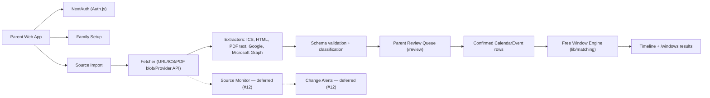

# Architecture

## Decisions

| Area | Decision |
|---|---|
| Product surface | Private beta |
| Platform | Responsive web app first, native mobile later |
| Frontend | Next.js + TypeScript |
| Backend | Next.js server actions + route handlers for MVP; extract workers/services when ingestion load requires it |
| Database | PostgreSQL |
| ORM | Prisma |
| File storage | Local filesystem in development; object storage in beta/prod |
| Auth | NextAuth v5 (Auth.js) + Prisma adapter, JWT sessions, email/password (bcryptjs) + Google + Apple. Microsoft is a linkable provider for Outlook calendar access, not a sign-in option. |
| Calendar integrations | PDF, URL, ICS, Google Calendar, Outlook Calendar |
| Parsing | Deterministic parsers shipped today (ICS, HTML, PDF text, Google, Microsoft Graph); LLM-assisted extraction documented but not yet built. |
| Review model | Parent confirmation required before extracted events affect recommendations |

## System Overview



Dashed nodes are not yet implemented. Source refresh fires only when a `CalendarSource` is first created; no scheduler exists yet (issue #12).

## Core Services

| Service | Status | Responsibility |
|---|---|---|
| Auth service | Shipped (#17, PR #31) | NextAuth v5 + Prisma adapter. Configured in [`auth.ts`](../auth.ts) and gated by [`middleware.ts`](../middleware.ts). Email/password via Credentials provider with bcrypt; Google, Apple, and Microsoft as OAuth providers (Microsoft is linkable but not on the login UI). |
| Family service | Shipped | Families, children, calendar ownership, calendar tags. Pure helpers in [`lib/family/dashboard.ts`](../lib/family/dashboard.ts); auth-coupled session resolution in [`lib/family/session.ts`](../lib/family/session.ts). |
| Source service | Shipped (URL/ICS/PDF/Google/Outlook) | URL/PDF/ICS/provider source metadata. Provider-specific ingest orchestrators live in `lib/sources/*-ingest.ts`. |
| Fetch service | Shipped | URL/ICS via global `fetch`; PDF via the local filesystem under `FILE_STORAGE_ROOT`; Google via Calendar API v3; Microsoft via Graph v1.0. |
| Extract service | Shipped | Pure event extractors under [`lib/sources/extractors/`](../lib/sources/) (ICS, HTML, PDF text) plus provider mappers (`google-ingest.ts`, `microsoft-ingest.ts`). |
| Normalize service | Shipped | Validation via `eventCandidateInputSchema` + classification (keyword heuristic for HTML/PDF; provider-aware classification for ICS/Google/Outlook). |
| Review service | Shipped (#8, PR #23) | `/review` route + `lib/review/`. Pure helpers test-covered; server actions in `app/review/actions.ts`. |
| Matching service | Shipped (#9, PR #24) | `lib/matching/free-windows.ts` math + `lib/matching/event-busy.ts` interval mapper + `lib/matching/search.ts` server orchestration. |
| Alert service | Deferred (#12) | Source-change detection and saved-window invalidation. Not yet implemented. |

## Authentication

Implemented in [`auth.ts`](../auth.ts) using `next-auth@^5.0.0-beta` with `@auth/prisma-adapter`.

- **Session strategy:** JWT (no `Session` DB rows hit on every request). The `Session` and `VerificationToken` Prisma models exist for completeness but are unused by the current JWT-mode setup.
- **Providers:**
  - **Credentials** — always on. Reads `User.passwordHash` and verifies with `bcryptjs.compare`. Login schema in [`lib/auth/schemas.ts`](../lib/auth/schemas.ts).
  - **Google** — conditional on `GOOGLE_CLIENT_ID`/`GOOGLE_CLIENT_SECRET`. Scopes: `openid email profile https://www.googleapis.com/auth/calendar.readonly`. `access_type=offline`, `prompt=consent`, `allowDangerousEmailAccountLinking=true`.
  - **Apple** — conditional on `APPLE_CLIENT_ID`/`APPLE_CLIENT_SECRET`. Sign-in only; Apple Calendar API not used.
  - **Microsoft Entra ID** — conditional on `MICROSOFT_CLIENT_ID`/`MICROSOFT_CLIENT_SECRET`. Issuer `/common/v2.0` (work + personal accounts). Scopes: `openid email profile offline_access Calendars.Read`. `prompt=consent`, `allowDangerousEmailAccountLinking=true`. Linkable provider, not surfaced on `/login`.
- **Middleware:** [`middleware.ts`](../middleware.ts) gates every route except `/login`, `/register`, `/api/auth/*`, `/_next/*`, and `/favicon.ico`. Unauthenticated requests redirect to `/login?callbackUrl=...`. Next 16 deprecation note: the file should rename to `proxy.ts` eventually.
- **Family resolution seam:** `requireUserFamily()` in [`lib/family/session.ts`](../lib/family/session.ts) is called by every server action and page reader. It lazily creates a `Family` row owned by the signed-in user if one doesn't exist.
- **Why the file split:** `dashboard.ts` is pure (no `@/auth` import) so the helper tests run under vitest without `server.deps.inline` transformation. `session.ts` is the auth-coupled wrapper.

## Calendar Provider Integrations

OAuth-backed calendar imports use the NextAuth `Account` row attached to the signed-in user. Tokens are stored as **plaintext columns** today (`access_token`, `refresh_token`, `expires_at`); `OAUTH_TOKEN_ENCRYPTION_KEY` is declared in `.env.example` but is not yet wired for column-level encryption — see [`TECH_DEBT.md`](./TECH_DEBT.md).

### Google Calendar (#13, PR #33)

- API client: [`lib/sources/google.ts`](../lib/sources/google.ts).
- Orchestrator: [`lib/sources/google-ingest.ts`](../lib/sources/google-ingest.ts).
- Token refresh: `oauth2.googleapis.com/token` with `grant_type=refresh_token`; rotated tokens land back in the `Account` row.
- API surface used: `/users/me/calendarList`, `/calendars/{id}/events?singleEvents=true&orderBy=startTime`.
- Sync window: 30 days back, 365 days forward. No scheduler.
- Connect flow: dashboard's `linkGoogleAccountAction` calls `signIn("google")`. With `allowDangerousEmailAccountLinking`, this links to the existing Togetherly user when the Google email matches.

### Outlook Calendar (#18, PR #34)

- API client: [`lib/sources/microsoft.ts`](../lib/sources/microsoft.ts).
- Orchestrator: [`lib/sources/microsoft-ingest.ts`](../lib/sources/microsoft-ingest.ts).
- Token refresh: `login.microsoftonline.com/common/oauth2/v2.0/token` with `grant_type=refresh_token` and the same scope set as the original grant.
- API surface used: `/v1.0/me/calendars` and `/v1.0/me/calendars/{id}/calendarView` with `Prefer: outlook.timezone="UTC"`. Pagination via `@odata.nextLink`.
- Sync window: 30 days back, 365 days forward.
- Connect flow: same shape as Google via `linkMicrosoftAccountAction`.

### URL / ICS / PDF

- ICS (#5, PR #22): [`lib/sources/extractors/ics.ts`](../lib/sources/extractors/ics.ts) using `ical.js`. RRULE expansion handled in-extractor.
- HTML (#6, PR #29): [`lib/sources/extractors/html.ts`](../lib/sources/extractors/html.ts) using `jsdom` (moved from devDependencies to runtime deps).
- PDF text (#7, PR #30): [`lib/sources/extractors/pdf.ts`](../lib/sources/extractors/pdf.ts) using `pdf-parse` loaded via `createRequire` to evade bundler embedding.

## Repository Shape (current, not aspirational)

```text
app/
  api/auth/[...nextauth]/route.ts   NextAuth handler
  components/Timeline.tsx           Real per-child timeline (PR #27)
  login/, register/                 Auth surfaces (PR #31)
  review/                           Review queue UI + actions (PR #23)
  windows/                          Free-window search + results (PR #24)
  actions.ts                        Top-level server actions (sources, search, sign-out, OAuth link, etc.)
  page.tsx                          Dashboard
  globals.css                       Utility CSS (Stitch design integration is #32)
auth.ts                             NextAuth config (root, imported by middleware + handlers)
middleware.ts                       Route gating (rename to proxy.ts is a Next 16 follow-up)
lib/
  auth/schemas.ts                   Zod schemas for credentials login/register
  db/prisma.ts                      Prisma client singleton
  domain/                           Event taxonomy + canonical schemas
  family/
    dashboard.ts                    Pure family-resolution helpers
    session.ts                      auth() wrapper, requireUserFamily()
    timeline.ts                     Dashboard timeline data shaping
  matching/                         free-windows + event-busy + search orchestrator
  review/                           Candidate → CalendarEvent helpers + queue reader
  sources/
    extractors/                     Pure extractors (ics, html, pdf)
    google.ts, google-ingest.ts     Google Calendar API client + orchestrator
    microsoft.ts, microsoft-ingest.ts Outlook API client + orchestrator
    ics-ingest.ts, html-ingest.ts, pdf-ingest.ts
    source-metadata.ts, storage.ts  Source-type metadata + local PDF blob store
prisma/
  schema.prisma                     User/Account/Session + Family/Child/Calendar/CalendarSource/EventCandidate/CalendarEvent/FreeWindowSearch/FreeWindowResult
  migrations/
  seed.mjs                          Demo family seed (bcrypt-hashed passwordHash)
fixtures/
  README.md
  sources/{html,pdf,ics}/
  expected-events/
docs/
```

## Runtime Flow

1. Parent signs in via `/login` (credentials, Google, or Apple) or registers at `/register`. Middleware redirects all other routes to `/login` when unauthenticated.
2. `requireUserFamily()` resolves (or lazily creates) the parent's `Family` row on first dashboard load.
3. Parent creates children and calendars.
4. Parent adds a calendar source: URL/ICS/PDF directly, or links a Google/Microsoft account and picks one of their calendars.
5. The source-creation server action persists the `CalendarSource` row and **synchronously** kicks off the matching extractor/orchestrator. On success: `parserType` is set, `lastFetchedAt`/`lastParsedAt` are stamped, `refreshStatus` becomes `OK` (or `NEEDS_REVIEW` if any per-event errors), and `EventCandidate` rows are inserted. On failure: `refreshStatus=FAILED` and the error is logged.
6. Parent visits `/review`, confirms / edits / rejects candidates. Confirmation creates a `CalendarEvent` row linked to the candidate.
7. Parent visits `/windows`, picks date range + minimum days + unknown/exam-handling flags. The search action reads confirmed `CalendarEvent` rows, builds busy intervals, computes free windows with `findExplainedFreeWindows`, persists a `FreeWindowSearch` + `FreeWindowResult` rows, and redirects to the results view.
8. Dashboard `/` renders a per-child timeline of confirmed events with low-confidence shading and (when available) the latest recommended-window overlay.

## Deployment Assumption

Private beta can run as a hosted Next.js app with managed PostgreSQL and object storage. Background work is currently a route-triggered task (extractors fire inline during source creation). Move to a queue once source refresh (#12), large PDFs, or provider sync jobs require durable async processing.

## Architecture Risks

| Risk | Status | Mitigation |
|---|---|---|
| Ingestion jobs become slow | Open | Introduce queue and worker process before public launch. Today all extractors run inline during the create-source request. |
| LLM extraction is inconsistent | Deferred | LLM-assist not yet implemented; deterministic parsers handle the MVP corpus. |
| OAuth tokens require strict handling | Partial | Auth.js encrypts cookies via `AUTH_SECRET`; provider tokens are stored as plaintext columns. Column-level encryption with `OAUTH_TOKEN_ENCRYPTION_KEY` is tracked in `TECH_DEBT.md`. |
| Date/time bugs affect recommendations | Mitigated | Extractors anchor all-day events at UTC midnight; ICS recurrence + DST tests live in `lib/sources/extractors/ics.test.ts`. |
| Parser code becomes source-specific | Mitigated | Fixtures live under `fixtures/sources/` keyed by structural pattern, not school name. Extractor logic is keyword/heuristic-based, not hard-coded per institution. |
| Email-based account linking allows takeover | Open | `allowDangerousEmailAccountLinking=true` on Google + Microsoft providers. Acceptable for private beta; revisit before public launch (`TECH_DEBT.md`). |
