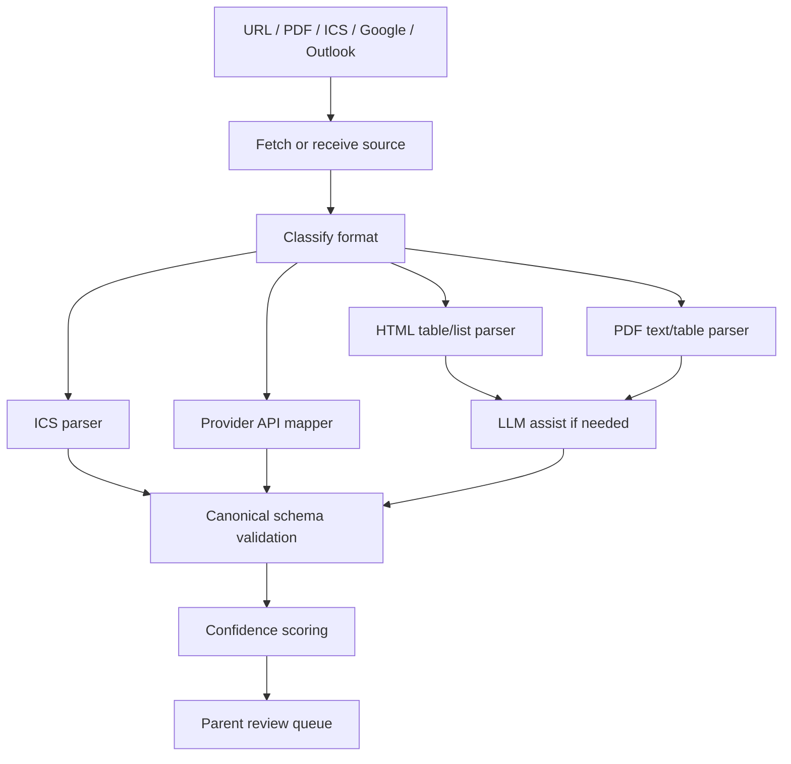

# Parsing Strategy

## Strategy

Use a hybrid parsing approach:

1. Deterministic parsers for structured formats.
2. LLM-assisted extraction for messy natural-language, PDF, and mixed-layout cases.
3. Schema validation for all extracted events.
4. Parent review before extracted events affect recommendations.

## Source Pipeline

## Parser Types

| Parser | Status | Implementation |
|---|---|---|
| ICS parser | ✅ Shipped (#5, PR #22) | [`lib/sources/extractors/ics.ts`](../lib/sources/extractors/ics.ts) via `ical.js`. Expands RRULE recurrence, handles DST, anchors all-day events at UTC midnight. |
| Google Calendar mapper | ✅ Shipped (#13, PR #33) | [`lib/sources/google-ingest.ts`](../lib/sources/google-ingest.ts) + [`google.ts`](../lib/sources/google.ts). Uses `singleEvents=true` so the API expands recurrence server-side. |
| Outlook Calendar mapper | ✅ Shipped (#18, PR #34) | [`lib/sources/microsoft-ingest.ts`](../lib/sources/microsoft-ingest.ts) + [`microsoft.ts`](../lib/sources/microsoft.ts) using Microsoft Graph `calendarView` with `Prefer: outlook.timezone="UTC"`. |
| HTML table/list parser | ✅ Shipped (#6, PR #29) | [`lib/sources/extractors/html.ts`](../lib/sources/extractors/html.ts) via `jsdom`. Walks table / `dl` / `ul` patterns; keyword-based classification. |
| PDF text parser | ✅ Shipped (#7, PR #30) | [`lib/sources/extractors/pdf.ts`](../lib/sources/extractors/pdf.ts) via `pdf-parse` (loaded through `createRequire` to evade bundler embedding). |
| LLM extraction | ⬜ Deferred | Documented below; not yet wired. The deterministic parsers cover the current MVP corpus. |
| OCR parser | ⬜ Deferred (P2) | Out of scope for MVP per [`MVP_SPEC.md`](./MVP_SPEC.md#p2-scope). |

## Confidence Scoring

Confidence should combine:

- Date parse confidence.
- Event title confidence.
- Category confidence.
- Source format reliability.
- Parser reliability.
- Evidence quality.

Suggested bands:

| Confidence | Behavior |
|---:|---|
| 0.90-1.00 | High confidence; eligible for bulk confirmation |
| 0.70-0.89 | Normal review |
| 0.40-0.69 | Low-confidence review with warning |
| Below 0.40 | Do not recommend; ask user to enter manually |

## Current Confidence Heuristic (HTML/PDF)

The HTML and PDF extractors classify events by keyword on the title:

| Keyword pattern | Category | Confidence |
|---|---|---|
| `break`, `vacation`, `holiday`, `no school` | `BREAK` | 0.7 |
| `final`, `exam`, `midterm` (HTML) / `final examination`, `finals week`, `exam`, `midterm` (PDF) | `EXAM_PERIOD` | 0.65 |
| `instruction begins/ends`, `first day`, `last day`, `term begins/ends`, `classes begin/end`, `quarter begins/ends`, `semester begins/ends`, `school resumes/starts` | `CLASS_IN_SESSION` | 0.65 |
| Anything else | `UNKNOWN` | 0.4 |

All four are below the 0.9 bulk-confirmation threshold so `requiresParentReview` flags every HTML/PDF candidate. ICS, Google, and Outlook ingest classify by calendar type: activity-type calendars (SPORT/MUSIC/ACTIVITY/CAMP) get `ACTIVITY_BUSY` at ≥0.9; other types get `UNKNOWN` at 0.55.

## LLM Usage Rules (when LLM-assist lands)

- LLM output must be constrained to a strict JSON schema.
- LLM output must include evidence text or location for every event.
- LLM output must never create confirmed events directly.
- LLM output must be validated for date ranges and category values.
- Failed validation sends the source to manual review or fallback extraction.
- Per [`PRIVACY.md` §5.1](./PRIVACY.md#51-llm-assisted-extraction): only public source text may be sent; no parent email/name, child nickname, family ID, OAuth tokens, or private PDFs.

## Initial Extraction Targets

- Breaks.
- Holidays.
- School-closed days.
- Term start/end.
- Instruction start/end.
- Exam periods.
- Activity events from ICS/provider calendars.

## Non-Targets For MVP Extraction

- Room-level school bell schedules.
- Individual university course schedules.
- Attendance records.
- Assignment deadlines.
- Portal-only data.
- Implicit availability without review.
