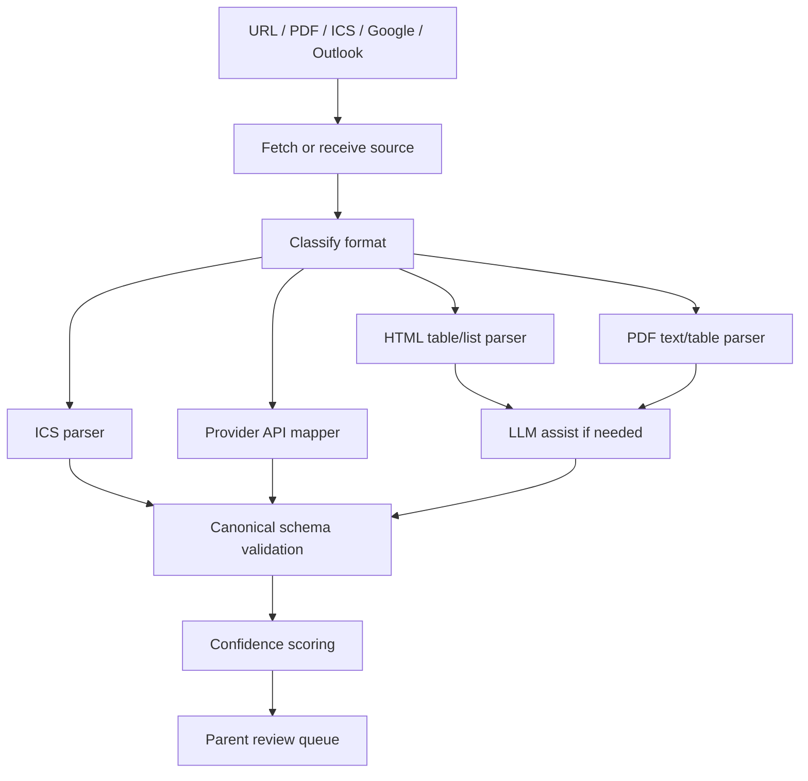

# Parsing Strategy

## Strategy

Use a hybrid parsing approach:

1. Deterministic parsers for structured formats.
2. LLM-assisted extraction for messy natural-language, PDF, and mixed-layout cases.
3. Schema validation for all extracted events.
4. Parent review before extracted events affect recommendations.

## Source Pipeline

## Parser Types

| Parser | MVP Role |
|---|---|
| ICS parser | High-confidence path for activity and school feeds |
| Google Calendar mapper | Imports selected calendars through API |
| Outlook Calendar mapper | Imports selected calendars through Microsoft Graph |
| HTML table/list parser | Handles registrar pages and district pages |
| PDF text parser | Handles text-based academic calendars |
| LLM extraction | Handles ambiguous labels, natural-language tables, and semi-structured PDF text |
| OCR parser | Deferred unless source corpus requires it |

## Confidence Scoring

Confidence should combine:

- Date parse confidence.
- Event title confidence.
- Category confidence.
- Source format reliability.
- Parser reliability.
- Evidence quality.

Suggested bands:

| Confidence | Behavior |
|---:|---|
| 0.90-1.00 | High confidence; eligible for bulk confirmation |
| 0.70-0.89 | Normal review |
| 0.40-0.69 | Low-confidence review with warning |
| Below 0.40 | Do not recommend; ask user to enter manually |

## LLM Usage Rules

- LLM output must be constrained to a strict JSON schema.
- LLM output must include evidence text or location for every event.
- LLM output must never create confirmed events directly.
- LLM output must be validated for date ranges and category values.
- Failed validation sends the source to manual review or fallback extraction.

## Initial Extraction Targets

- Breaks.
- Holidays.
- School-closed days.
- Term start/end.
- Instruction start/end.
- Exam periods.
- Activity events from ICS/provider calendars.

## Non-Targets For MVP Extraction

- Room-level school bell schedules.
- Individual university course schedules.
- Attendance records.
- Assignment deadlines.
- Portal-only data.
- Implicit availability without review.
