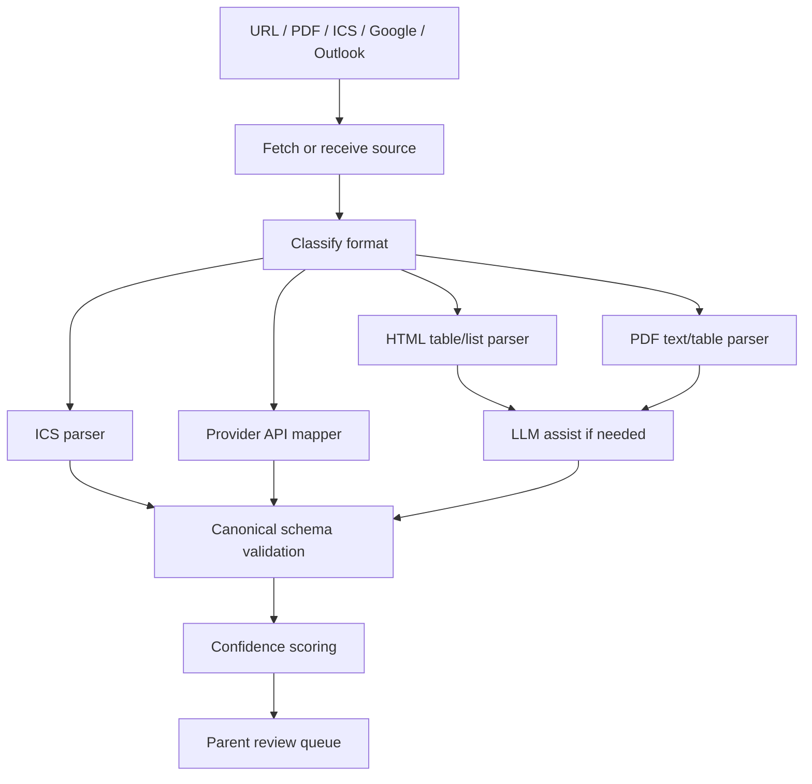

# Parsing Strategy

## Strategy

Use a layered parsing approach:

1. **Deterministic parsers** for structured formats (ICS, Google API, Outlook Graph, HTML tables, PDF text).
2. **Boundary-pair inference** for academic calendars — recognize `Quarter/Semester/Term Begins/Ends`, `First/Last Day of Classes`, `Final Examinations Begin/End` markers and synthesize `class_in_session` / `exam_period` interval candidates between them (EXT-009, Round 16).
3. **LLM-assisted classification** for ambiguous candidates — when the heuristic returns `UNKNOWN` or confidence < 0.6, escalate to Claude with structured output (EXT-010, Round 17).
4. **Schema validation** for all extracted events (Zod).
5. **Parent review** before extracted events affect recommendations.

## Source Pipeline

## Parser Types

| Parser | Status | Implementation |
|---|---|---|
| ICS parser | ✅ Shipped (#5, PR #22) | [`lib/sources/extractors/ics.ts`](../lib/sources/extractors/ics.ts) via `ical.js`. Expands RRULE recurrence, handles DST, anchors all-day events at UTC midnight. |
| Google Calendar mapper | ✅ Shipped (#13, PR #33) | [`lib/sources/google-ingest.ts`](../lib/sources/google-ingest.ts) + [`google.ts`](../lib/sources/google.ts). Uses `singleEvents=true` so the API expands recurrence server-side. |
| Outlook Calendar mapper | ✅ Shipped (#18, PR #34) | [`lib/sources/microsoft-ingest.ts`](../lib/sources/microsoft-ingest.ts) + [`microsoft.ts`](../lib/sources/microsoft.ts) using Microsoft Graph `calendarView` with `Prefer: outlook.timezone="UTC"`. |
| HTML table/list parser | ✅ Shipped (#6, PR #29) | [`lib/sources/extractors/html.ts`](../lib/sources/extractors/html.ts) via `jsdom`. Walks table / `dl` / `ul` patterns; keyword-based classification. |
| PDF text parser | ✅ Shipped (#7, PR #30) | [`lib/sources/extractors/pdf.ts`](../lib/sources/extractors/pdf.ts) via `pdf-parse` (loaded through `createRequire` to evade bundler embedding). |
| Boundary-pair recognizer | ⬜ Phase 2.5 (Round 16) | `lib/sources/extractors/boundary-pairs.ts` — pairs academic boundary keywords by chronology and synthesizes `CLASS_IN_SESSION` / `EXAM_PERIOD` candidates between them. Closes [#131](https://github.com/igortsives/togetherly/issues/131). |
| LLM-assisted classification | ⬜ Phase 2.5 (Round 17) | `lib/llm/anthropic.ts` + extraction post-pass. Closes [#52](https://github.com/igortsives/togetherly/issues/52). |
| OCR parser | ⬜ Deferred (P2) | Out of scope for MVP per [`MVP_SPEC.md`](./MVP_SPEC.md#p2-scope). |

## Confidence Scoring

Confidence should combine:

- Date parse confidence.
- Event title confidence.
- Category confidence.
- Source format reliability.
- Parser reliability.
- Evidence quality.

Suggested bands:

| Confidence | Behavior |
|---:|---|
| 0.90-1.00 | High confidence; eligible for bulk confirmation |
| 0.70-0.89 | Normal review |
| 0.40-0.69 | Low-confidence review with warning |
| Below 0.40 | Do not recommend; ask user to enter manually |

## Current Confidence Heuristic (HTML/PDF)

The HTML and PDF extractors classify events by keyword on the title:

| Keyword pattern | Category | Confidence |
|---|---|---|
| `break`, `vacation`, `holiday`, `no school` | `BREAK` | 0.7 |
| `final`, `exam`, `midterm` (HTML) / `final examination`, `finals week`, `exam`, `midterm` (PDF) | `EXAM_PERIOD` | 0.65 |
| `instruction begins/ends`, `first day`, `last day`, `term begins/ends`, `classes begin/end`, `quarter begins/ends`, `semester begins/ends`, `school resumes/starts` | `CLASS_IN_SESSION` | 0.65 |
| Anything else | `UNKNOWN` | 0.4 |

All four are below the 0.9 bulk-confirmation threshold so `requiresParentReview` flags every HTML/PDF candidate. ICS, Google, and Outlook ingest classify by calendar type: activity-type calendars (SPORT/MUSIC/ACTIVITY/CAMP) get `ACTIVITY_BUSY` at ≥0.9; other types get `UNKNOWN` at 0.55.

## Boundary-Pair Inference (EXT-009)

The recognizer is **synonym-based, not literal-string-based**. Academic institutions use wildly different vocabulary — universities say "Quarter" or "Semester" or "Trimester" or "Term"; K-12 says "School" or "School Year"; some use "Instruction" or "Classes" or "Session" interchangeably. The recognizer composes phrases from three slots — a verb, an academic-unit noun, and an optional "Day of …" prefix — and pairs any matched begin-phrase with the next matched end-phrase chronologically within the same source.

### Slot 1: Begin verbs

`begins`, `starts`, `opens`, `commences`, plus the noun-phrase forms `First Day of …` and `Beginning of …`.

### Slot 2: End verbs

`ends`, `concludes`, `closes`, `finishes`, plus the noun-phrase forms `Last Day of …` and `End of …`.

### Slot 3: Academic-unit nouns

`Quarter`, `Semester`, `Trimester`, `Term`, `Module`, `Session`, `School Year`, `Academic Year`, `School`, `Instruction`, `Classes`. Singular or plural.

### Resulting interval

| Pair shape | Synthesized interval |
|---|---|
| `<unit> <begins>` ↔ `<unit> <ends>` (where unit is one of the academic-unit nouns) | `CLASS_IN_SESSION` (weekdaysOnly) |
| `First Day of <unit>` ↔ `Last Day of <unit>` | `CLASS_IN_SESSION` (weekdaysOnly) |
| Mix of the two (e.g. `Quarter Begins` ↔ `Last Day of Quarter`) | `CLASS_IN_SESSION` (weekdaysOnly) |
| Any `Final Examinations` / `Finals` / `Finals Week` / `Final Exams` begin ↔ matching end | `EXAM_PERIOD` |
| `Reading Days` / `Reading Period` / `Study Days` begin ↔ matching end | `EXAM_PERIOD` (lower confidence) |
| `Midterm Examinations` / `Midterms` / `Midterm Week` begin ↔ matching end | `EXAM_PERIOD` (lower confidence) |

### Examples this should match without per-school code

- UCLA (quarter system): `Fall Quarter Begins` ↔ `Fall Quarter Ends`; `Instruction Begins` ↔ `Instruction Ends`; `Final Examinations` ↔ `End of Final Examinations`.
- Vanderbilt (semester system): `Fall Semester Begins` ↔ `Fall Semester Ends`; `Classes Begin` ↔ `Classes End`.
- Stanford (quarter system): `Autumn Quarter Begins` ↔ `Autumn Quarter Ends`; `End-Quarter Period`.
- Most K-12 districts: `First Day of School` ↔ `Last Day of School`; `School Begins` ↔ `School Ends`.
- Independent schools / trimester systems: `Fall Trimester` ↔ `End of Fall Trimester`; `Winter Term Begins` ↔ `Winter Term Ends`.

### Markers that are NOT eligible for pairing

Single-day markers like `School Resumes`, `Classes Resume`, `Return from Break` are kept in the existing keyword heuristic as `CLASS_IN_SESSION` candidates but are NOT paired by the recognizer — they have no natural counterpart and pairing them would generate runaway intervals that span the entire calendar. The recognizer also skips any begin/end candidate whose `confidence < 0.6` from the heuristic layer, to avoid amplifying low-quality matches.

### Confidence and conflict handling

- A synthesized interval inherits the lower of its two boundary markers' confidences, capped at 0.85 (synthesized events never bulk-confirm — they always show in the review queue for parent inspection).
- If a source produces overlapping intervals (e.g., a malformed PDF lists two `Fall Quarter Begins` rows), the recognizer keeps the earliest begin paired with the latest end and records the conflict in the candidate's `evidenceText` for parent review.
- A begin marker without a matching end (within the same source, within 200 days) is NOT paired by the recognizer. The LLM post-pass (EXT-010) is the fallback for inferring missing boundaries — e.g., when only `Winter Quarter Begins` is listed and the next quarter's `Spring Quarter Begins` is the implicit end.

Pairing is chronological within a single `CalendarSource`. If a source contains only one marker (e.g., `Winter Quarter Begins` with no explicit end), the recognizer DOES NOT synthesize a half-open interval — instead the LLM post-pass (EXT-010) is the fallback for inferring the missing boundary based on the next term's start. Boundary markers themselves remain in the candidate set so the parent can review them; the synthesized interval is an additional candidate with its own `evidenceLocator` pointing to both markers.

The `CLASS_IN_SESSION` carrier interval is consumed by `lib/matching/event-busy.ts` with a `weekdaysOnly` semantics — Sat/Sun inside an in-session range stay free (MAT-010).

## LLM Usage Rules (Round 17 onward)

- LLM features no-op gracefully when `ANTHROPIC_API_KEY` is unset.
- LLM output must be constrained to a strict structured-output schema (Zod-validated).
- LLM output must include evidence text or location for every event.
- LLM output must never create confirmed events directly. Output stays in the candidate queue subject to parent review.
- LLM output must be validated for date ranges and category values.
- Failed validation falls back to the heuristic result (deterministic baseline) or surfaces to the user; no silent application of unvalidated text.
- Per [`PRIVACY.md` §5.1](./PRIVACY.md#51-llm-assisted-extraction) and PRD AI-004: only public source text may be sent; no parent email/name, child nickname, family ID, OAuth tokens, or private PDFs.
- Logs record only `{ kind, candidateCount, latencyMs, success }` (AI-006).

## Initial Extraction Targets

- Breaks.
- Holidays.
- School-closed days.
- Term start/end.
- Instruction start/end.
- Exam periods.
- Activity events from ICS/provider calendars.

## Non-Targets For MVP Extraction

- Room-level school bell schedules.
- Individual university course schedules.
- Attendance records.
- Assignment deadlines.
- Portal-only data.
- Implicit availability without review.
